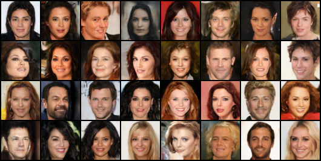

# Cold Diffusion
A simple general purpose PyTorch implementation of Denoising Cold Diffusion in both image and latent space.

# My PyTorch Deep Learning Series on YouTube
[Whole Playlist](https://youtube.com/playlist?list=PLN8j_qfCJpNhhY26TQpXC5VeK-_q3YLPa&si=EVHfovKS-vQ_VZ5a)<br>
[PyTorch Cold Diffusion Basics](https://youtu.be/8SVV1FGFtik?si=qLEJoZaA8YJZ-q9T)

# If you found this code useful
[Buy me a Coffee](https://www.buymeacoffee.com/lukeditria)

## Results
### Regular Diffusion (32x32)


# Training Examples

## Regular Diffusion

### Basic training command:
Works well for 64x64 sized images with a low-to-average diversity dataset

```
python train.py -mn test_run --dataset_root /path/to/dataset/root
```

### Starting from an existing checkpoint:
The code will attempt to load a checkpoint with the name provided in the "save_dir" specified.

```
python train.py -mn test_run --load_checkpoint --dataset_root /path/to/dataset/root
```

### Define a Custom Architecture:
Example showing how to define each of the main parameters of the Unet Architecture.
Increasing the model depth can help with larger images, increasing width can help with more diverse datasets

```
python train.py -mn test_run --block_widths 1 2 4 8 --ch_multi 64 --dataset_root /path/to/dataset/root
```

### Change number of diffusion steps:

```
python train.py -mn test_run --num_steps 200 --dataset_root /path/to/dataset/root
```

## Latent Diffusion

### Step 1: Extract Features
Before training the latent diffusion model, you need to extract latent features from your dataset:

```
python Extract_Features.py --dataset_dir /path/to/image/dataset --latent_save_dir /path/to/save/latents --image_size 256 --batch_size 32
```

### Step 2: Train Latent Diffusion Model
After extracting features, you can train the latent diffusion model:
```
python train_latent_diff.py -mn latent_test --dataset_root /path/to/latents --latent_size 32 --batch_size 32
```


### Additional Options for Latent Diffusion:
- Adjust learning rate: `--lr 1e-4`
- Change number of epochs: `--nepoch 1000`
- Specify GPU: `--device_index 0`
- Load from checkpoint: `--load_checkpoint`

## Common Options for Both Models:
- Save interval: `--save_interval 256`
- Gradient accumulation steps: `--accum_steps 1`
- Channel multiplier: `--ch_multi 64`
- Block widths: `--block_widths 1 2 4 8`
